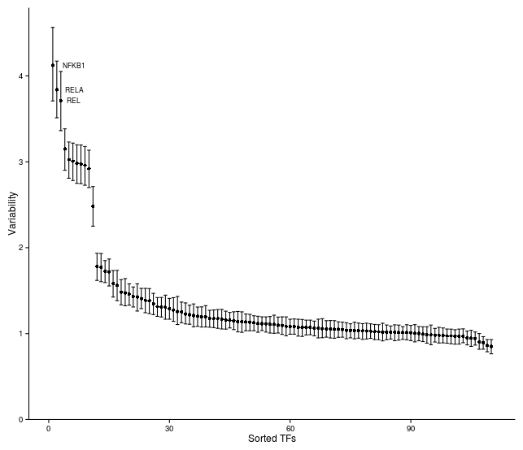
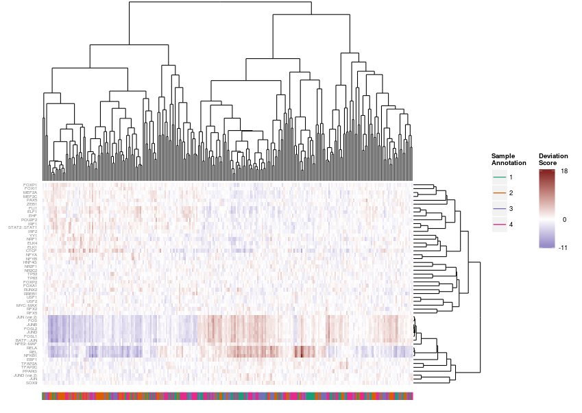

# chromVAR

##Installation
Installation is easiest using the devtools package.  The function `install_github` will install the package.
```{r}
devtools::install_github("GreenleafLab/chromVAR", auth_token = "my_token")
```
The argument auth_token takes in your github [personal acces token](https://github.com/settings/applications).  This token is needed because at the moment this repository is private.  

A number of needed packages are installed in this process. Note that for functions that require a genome sequence, the package [BSgenome.Hsapiens.UCSC.hg19](https://bioconductor.org/packages/release/data/annotation/html/BSgenome.Hsapiens.UCSC.hg19.html) is used as a default argument. However that package will not be automatically installed -- if using the default argument and that genome build, you will need to install that package.  If using another genome build, the appropraiate BSgenome object for your species should be passed to functions requiring a genome build (e.g. `get_motif_indices`, `get_gc`, and `get_kmer_indices`).

Depending on your repository settings, the Bioconductor dependencies may fail to install.  Use `setRepositories(graphics=F)` to see what repositories you have activated and to add the BioC software repository if need be.  

##Loading the package
Use library or require to load package.
```{r}
library(chromVAR)
```

##Setting multiprocessing options
The package uses BiocParallel to do the multiprocessing.  Check the documentation for BiocParallel to see available options.  The settings can be set using the register function.  For example, to use MulticoreParam with 16 cores:
```{r}
BiocParallel::register(BiocParallel::MulticoreParam(16))
```

To enable progress bars for multiprocessed tasks, use 
```{r}
BiocParallel::register(BiocParallel::MulticoreParam(16, progressbar = TRUE))
```

##Reading in inputs
```{r}
bed <- "my_bedfile.bed"
bamfiles <- c('bam1.bam','bam2.bam')

peaks <- get_peaks(bed)
counts <- get_counts(bamfiles, peaks, paired =  TRUE, by_rg = TRUE, format = "bam")
```

The function `get_inputs` returns a list with two elements.  The first is a GenomicRanges object with the peaks.  The second is a Matrix of fragment counts per sample/cell for each peak.  The Matrix package is used so that if the matrix is sparse, the matrix will be stored as a sparse Matrix.  If you want to manipulate the counts data in any way in addition to use by chromVAR packages, it is a good idea to load the Matrix package (`library(Matrix)`).

##Getting GC content of peaks

The GC content will be used for derermining background peaks.  The function get_gc returns a GenomicRanges object identical to the input plus an extra annotation column named "gc".

```{r}
peaks <- get_gc(peaks)
```

Note that the function `get_gc` also takes in an argument for a BSgenome object.  The default is BSgenome.Hsapiens.UCSC.hg19, so if using a different genome build be sure to provide the correct genome. For example, if using sacCer3 you could do:
```{r}
library(BSgenome.Scerevisiae.UCSC.sacCer3)
peaks <- get_gc(peaks, genome = BSgenome.Scerevisiae.UCSC.sacCer3)
```

Check out `available.genomes` from the BSgenome package for what genomes are available. For making your own BSgenome object, check out `BSgenomeForge`.  


##Filtering inputs

If working with single cell data, it is advisable to filter out samples with insufficient reads or a low proportion of reads in peaks as these may represent empty wells or dead cells. 

```{r}
#compute sequencing depth from bamfiles
depths = get_sample_depths(bamfiles, paired =  TRUE, by_rg = TRUE, format = "bam")

#find indices of samples to keep
samples_to_keep = filter_samples(counts, depths)

#filter counts matrix
counts = counts[,samples_to_keep]

```

Two parameters are used for filtering -- min_in_peaks and min_depth.  If not provided (as above), these cutoffs are estimated based on the medians from the data.  min_in_peaks is set to 0.5 times the median proportion of fragments in peaks.  min_depth is set to the maximum of 500 or 10% of the median library size. 

Unless `plot = FALSE` given as argument to function `filter_samples`, the following type of plot will be generated:


Additional filtering can be done to remove cells/samples that appear very biased with regards to GC content and/or enrichment in accessibility.

```{r}
low_bias_samples = bias_filtering(counts, peaks)
counts = counts[, low_bias_samples]
```

For both bulk and single cell data, peaks should be filtered based on having at least a certain number of fragments. At minimum, each peak should have at least one fragment across all the samples (it might be possible to have peaks with zero reads due to using a peak set defined by other data). Otherwise, downstream functions won't work. The function `filter_peaks` will also reduce the peak set to non-overlapping peaks (keeping the peak with higher counts for peaks that overlap) if non_overlapping argument is set to TRUE (which is default). 

```{r}
peaks_to_keep = filter_peaks(counts, peaks, non_overlapping = TRUE)

counts = counts[peaks_to_keep,]
peaks = peaks[peaks_to_keep] #to keep peaks consistent with counts
```

##Finding background peaks

Background peaks are peaks that are similar to a peak in GC content and average accessibility.

```{r}
bg <- get_background_peaks(counts_mat = counts, bias = peaks)
```

The result from get_background_peaks is a matrix of indices, where each column represents the index of the peak that is a background peak.

##Get motifs and what peaks contain motifs
The function `get_motifs` fetches motifs from the JASPAR database.  
```{r}
motifs <- get_motifs()
```

The function get_motifs() by default gets human motifs from JASPAR core database.  For other species motifs, change the species argument.  
```{r}
motifs <- get_motifs(species = "Saccharomyces cerevisiae")
```
For using a collection other than core, use the `core` argument.  Options include: "CORE", "CNE", "PHYLOFACTS", "SPLICE", "POLII", "FAM", "PBM", "PBM_HOMEO", "PBM_HLH".

The `get_motifs` function is simply a wrapper around `getMatrixSet` from TFBSTools-- you can also use that function to fetch motifs from JASPAR if you prefer, and/or check out the documentation for that function for more information.  

The function `match_pwms` from the MOODSR package finds which peaks contain which motifs.  Install MOODSR using:
```{r}
devtools::install_github("AliciaSchep/MOODSR")
```
No auth token needed, as it is a public repo.

```{r}
require(MOODSR)

motif_ix <- match_pwms(motifs,  peaks, out = "match")
```

For the function `match_pwm` a genome sequence is again required.  So for sacCer3 for example:

```{r}
motif_ix <- match_pwms(motifs, peaks, genome = BSgenome.Scerevisiae.UCSC.sacCer3)
```

Another option is the p.cutoff for determing how stringent motif calling should be. The default value is 0.00005, which tends to give reasonable numbers of motif matches.  

##Compute deviations
```{r}
deviations <- compute_deviations(counts_mat = counts, background_peaks = bg, peak_indices = motif_ix)
```

The function `compute_deviations` returns a list with two matrices. The first matrix (deviations$z if using command above) will give the deviation z-score for each set of peaks (rows) for each cell or sample (columns).  These z-scores represent how accessible the set of peaks is relative to the expectation based on equal chromatin accessibility profiles across cells/samples, normalized by a set of background peak sets matched for GC and average accessability.   The second matrix (deviations$fc) will give the log2 fold change in accessibility for each set of peaks relative to the expected, again normalized by the set of background peaks.  


##Compute variability

```{r}
variability <- compute_variability(deviations$z)

plot_variability(variability, labels = TFBSTools::name(motifs[rownames(variability)])) 
```

The function `compute_variability` returns a data.frame that contains the variability (standard deviation of the z scores computed above across all cell/samples for a set of peaks), bootstrap confidence intervals for that variability (by resampling cells/samples), and a p-value for the variability being greater than the null hypothesis of 1.  

`plot_variability` takes the output of `compute_variability` and returns a plot like this:




The function `plot_deviations` can be used to generate a heatmap of deviations.

```{r}
plot_deviations(deviations$z[which(variability$p_value_adj<0.01),], 
                sample_annotation = anno, 
                set_names = TFBSTools::name(motifs[rownames(variability)])[which(variability$p_value_adj<0.01)]) 
```



Only the deviations for TFs that varied significantly were plotted. Sample annotations (in this case replicate number) was given to label the x axis. Motif names were given to label the y axis.  


