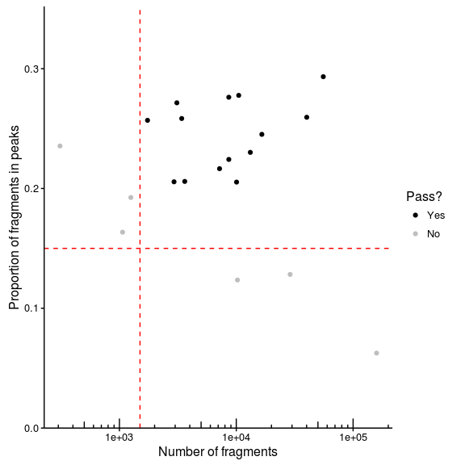
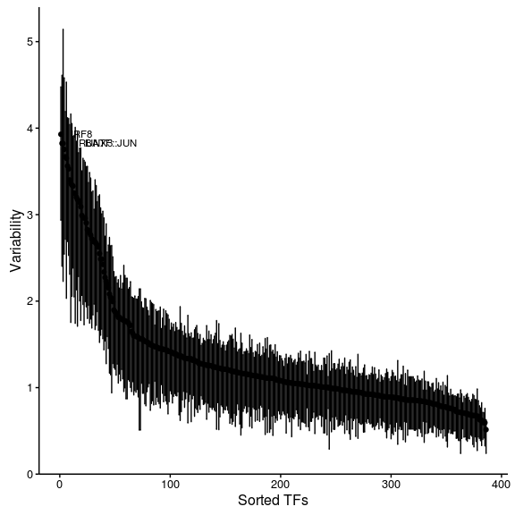
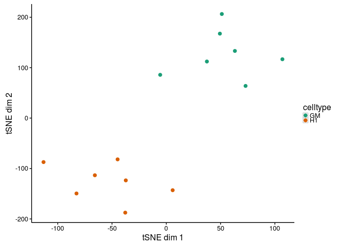
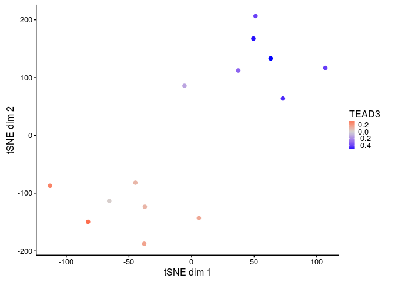

chromVAR is an R package for the analysis of sparse chromatin accessibility or histone modification data. The package incorporates motif matching code from the MOODS package, developed by Pasi Rastas, Janne Korhonen, and Petri Martinmaki.

Installation
------------

Installation is easiest using the devtools package. The function `install_github` will install the package.

``` r
devtools::install_github("GreenleafLab/chromVAR", auth_token = "my_token")
```

The argument auth\_token takes in your github [personal acces token](https://github.com/settings/applications). This token is needed because at the moment this repository is private.

A number of needed packages are installed in this process. Note that for functions that require a genome sequence, the package [BSgenome.Hsapiens.UCSC.hg19](https://bioconductor.org/packages/release/data/annotation/html/BSgenome.Hsapiens.UCSC.hg19.html) is used as a default argument. However that package will not be automatically installed -- if using the default argument and that genome build, you will need to install that package. If using another genome build, the appropraiate BSgenome object for your species should be passed to functions requiring a genome build (e.g. `match_pwms`, `add_gc_bias`).

Depending on your repository settings, the Bioconductor dependencies may fail to install. Use `setRepositories(graphics=F)` to see what repositories you have activated and to add the BioC software repository if need be.

Loading the package
-------------------

Use library or require to load package.

``` r
library(chromVAR)
```

Setting multiprocessing options
-------------------------------

The package uses BiocParallel to do the multiprocessing. Check the documentation for BiocParallel to see available options. The settings can be set using the register function. For example, to use MulticoreParam with 8 cores:

``` r
BiocParallel::register(BiocParallel::MulticoreParam(8))
```

To enable progress bars for multiprocessed tasks, use

``` r
BiocParallel::register(BiocParallel::MulticoreParam(8, progressbar = TRUE))
```

Reading in inputs
-----------------

``` r
# Not evaluated 
peakfile <- "mypeaks.bed"
peaks <- get_peaks(peakfile)

bamfiles <- c("mybam1.bam","mybam2.bam")
counts <- get_counts(bamfiles, peaks, paired =  TRUE, by_rg = TRUE, format = "bam", colData = DataFrame(celltype = c("GM","K562")))
```

The function `get_peaks` reads in the peaks as a GenomicRanges object. The function `get_counts` returns a RangedSummarizedExperiment object with a Matrix of fragment counts per sample/cell for each peak in assays. This data can be accessed with `assays(counts)$counts`. The Matrix package is used so that if the matrix is sparse, the matrix will be stored as a sparse Matrix.

For the rest of the vignette, we will use a very small example data set of 10 GM cells and 10 H1 cells that has already been read in as a RangedSummarizedExperiment object.

``` r
data(example_counts, package = "chromVAR")
head(example_counts)
```

    ## class: RangedSummarizedExperiment 
    ## dim: 6 20 
    ## metadata(0):
    ## assays(1): counts
    ## rownames: NULL
    ## rowData names(0):
    ## colnames(20): singles-GM-140815-1 singles-GM-140815-2 ...
    ##   singles-H1ESC-140820-9 singles-H1ESC-140820-10
    ## colData names(3): celltype treatment depth

Getting GC content of peaks
---------------------------

The GC content will be used for determining background peaks. The function `add_gc_bias` returns an updated SummarizedExperiment with a new rowData column named "bias".

``` r
example_counts <- add_gc_bias(example_counts)
head(rowData(example_counts))
```

    ## DataFrame with 6 rows and 1 column
    ##        bias
    ##   <numeric>
    ## 1     0.480
    ## 2     0.436
    ## 3     0.468
    ## 4     0.730
    ## 5     0.760
    ## 6     0.748

Note that the function `add_gc_bias` also takes in an argument for a BSgenome object. The default is BSgenome.Hsapiens.UCSC.hg19, so if using a different genome build be sure to provide the correct genome. For example, if using sacCer3 you could do:

``` r
# Not evaluated 
library(BSgenome.Scerevisiae.UCSC.sacCer3)
example_ounts <- add_gc_bias(example_counts, genome = BSgenome.Scerevisiae.UCSC.sacCer3)
```

Check out `available.genomes` from the BSgenome package for what genomes are available. For making your own BSgenome object, check out `BSgenomeForge`.

Filtering inputs
----------------

If working with single cell data, it is advisable to filter out samples with insufficient reads or a low proportion of reads in peaks as these may represent empty wells or dead cells. Two parameters are used for filtering -- min\_in\_peaks and min\_depth. If not provided (as above), these cutoffs are estimated based on the medians from the data. min\_in\_peaks is set to 0.5 times the median proportion of fragments in peaks. min\_depth is set to the maximum of 500 or 10% of the median library size.

Unless `plot = FALSE` given as argument to function `filter_samples`, a plot will be generated.

``` r
#find indices of samples to keep
counts_filtered <- filter_samples(example_counts, min_depth = 1500, min_in_peaks = 0.15, shiny = FALSE)
```

If shiny argument is set to TRUE (the default), a shiny gadget will pop up which allows you to play with the filtering parameters and see which cells pass filters or not.

To get just the plot of what is filtered, use `filter_samples_plot`. By default, the plot is interactive-- to set it as not interactive use DEFAULT = FALSE.

``` r
#find indices of samples to keep
filtering_plot <- filter_samples_plot(example_counts, min_depth = 1500, min_in_peaks = 0.15, interactive = FALSE)
filtering_plot
```



To instead return the indexes of the samples to keep instead of a new SummarizedExperiment object, use ix\_return = TRUE.

``` r
# Not evaluated 
ix <- filter_samples(example_counts, ix_return = TRUE, shiny = FALSE)
```

For both bulk and single cell data, peaks should be filtered based on having at least a certain number of fragments. At minimum, each peak should have at least one fragment across all the samples (it might be possible to have peaks with zero reads due to using a peak set defined by other data). Otherwise, downstream functions won't work. The function `filter_peaks` will also reduce the peak set to non-overlapping peaks (keeping the peak with higher counts for peaks that overlap) if non\_overlapping argument is set to TRUE (which is default).

``` r
counts_filtered <- filter_peaks(counts_filtered, non_overlapping = TRUE)
```

Get motifs and what peaks contain motifs
----------------------------------------

The function `get_jaspar_motifs` fetches motifs from the JASPAR database.

``` r
motifs <- get_jaspar_motifs()
```

The function get\_motifs() by default gets human motifs from JASPAR core database. For other species motifs, change the species argument.

``` r
# Not evaluated 
motifs <- get_jaspar_motifs(species = "Saccharomyces cerevisiae")
```

For using a collection other than core, use the `collection` argument. Options include: "CORE", "CNE", "PHYLOFACTS", "SPLICE", "POLII", "FAM", "PBM", "PBM\_HOMEO", "PBM\_HLH".

The `get_motifs` function is simply a wrapper around `getMatrixSet` from TFBSTools-- you can also use that function to fetch motifs from JASPAR if you prefer, and/or check out the documentation for that function for more information.

The function `match_pwms` finds which peaks contain which motifs. By default, it returns a SummarizedExperiment object of motifs versus peaks a matches assay that contains a sparse matrix indicating motif match or not.

``` r
motif_ix <- match_pwms(motifs, counts_filtered)
```

For the function `match_pwm` a genome sequence is again required. So for sacCer3 for example:

``` r
# Not evaluated 
motif_ix <- match_pwms(motifs, counts_filtered, genome = BSgenome.Scerevisiae.UCSC.sacCer3)
```

Another option is the p.cutoff for determing how stringent motif calling should be. The default value is 0.00005, which tends to give reasonable numbers of motif matches.

Instead of returning just motif matches, the function can also return additional matrices (stored as assays) with the number of motif matches per peak and the maximum motif score per peak. For this additional information, use `out = scores`. To return the actual positions of motif matches, use `out = positions`. Either the output with `out = matches` or `out = scores` can be passed to the compute\_deviations function.

Compute deviations
------------------

``` r
deviations <- compute_deviations(object = counts_filtered, annotations = motif_ix)
```

The function `compute_deviations` returns a SummarizedExperiment with three "assays". The first matrix (`assays(deviations)$deviations` if using command above) will give the normalized "deviation" in accessibility for each set of peaks (rows) for each cell or sample (columns). This metric represent how accessible the set of peaks is relative to the expectation based on equal chromatin accessibility profiles across cells/samples, normalized by a set of background peak sets matched for GC and average accessability. The second matrix (`assays(deviations)$z`) gives the deviation Z-score, which takes into account how likely such a score would occur if randomly sampling sets of beaks with similar GC content and average accessibility.

Background Peaks
----------------

The function compute\_deviations will use a set of background peaks for normalizing the deviation scores. This computation is done internally by default and not returned -- to have greater control over this step, a user can run the get\_background\_peaks function themselves and pass the result to compute\_deviations under the background\_peaks parameter.

Background peaks are peaks that are similar to a peak in GC content and average accessibility.

``` r
bg <- get_background_peaks(object = counts_filtered)
```

The result from get\_background\_peaks is a matrix of indices, where each column represents the index of the peak that is a background peak.

To use the background peaks computed, simply add those to the call to compute\_deviations:

``` r
# Not evaluated 
deviations <- compute_deviations(object = counts_filtered, annotations = motif_ix, background_peaks = bg)
```

Variability
-----------

``` r
variability <- compute_variability(deviations)

plot_variability(variability, interactive = FALSE) 
```



The function `compute_variability` returns a data.frame that contains the variability (standard deviation of the z scores computed above across all cell/samples for a set of peaks), bootstrap confidence intervals for that variability (by resampling cells/samples), and a p-value for the variability being greater than the null hypothesis of 1.

`plot_variability` takes the output of `compute_variability` and returns a plot of rank sorted annotation sets and their variability. By default, the plot will be interactive, unless you set `interactive = FALSE`.

Visualizing Deviations
----------------------

For visualizing cells, it can be useful to project the deviation values into two dimension using TSNE. A convenience function for doing so is provided in `deviations_tsne`. If running in an interactive session, shiny can be set to TRUE to load up a shiny gadget for exploring parameters.

``` r
tsne_results <- deviations_tsne(deviations, threshold = 1.3, perplexity = 4, shiny = FALSE)
```

To plot the results, `plot_deviations_tsne` can be used. If running in an interactive session or an interactive Rmarkdown document, shiny can be set to TRUE to generate a shiny widget. Here we will show static results.

``` r
tsne_plots <- plot_deviations_tsne(deviations, tsne_results, motif = "TEAD3", annotation_column = "celltype", shiny = FALSE)
tsne_plots[[1]]
```



``` r
tsne_plots[[2]]
```


